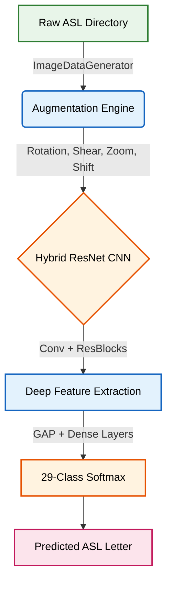
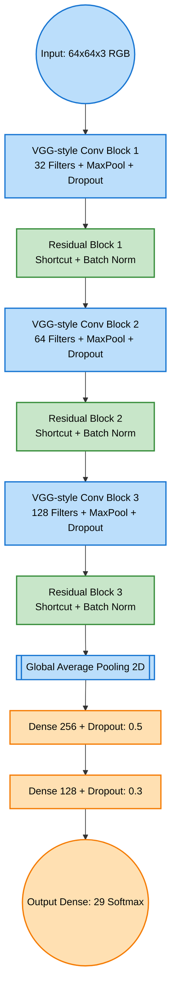

<div align="center">
  <h1 style="color: #2E3440;">🖐️ ASL Alphabet Recognition Using Computer Vision</h1>
  <p><strong><em>An end-to-end Deep Learning pipeline implementing a custom Residual Convolutional Neural Network (CNN) to classify 29 American Sign Language (ASL) gestures with high precision.</em></strong></p>
</div>

---

## Executive Summary
Built for scalability and robust real-world inference, this project processes RGB hand sign images to predict ASL alphabets (A-Z) plus special gestures (Space, Delete, Nothing). By leveraging a **Hybrid CNN with Custom Residual Blocks**, the architecture effectively solves the vanishing gradient problem in deep networks, allowing for deep feature extraction while maintaining a lightweight footprint through **Global Average Pooling (GAP)**.

**Tech Stack:** Python, TensorFlow / Keras, OpenCV, NumPy, Matplotlib, Seaborn

---

## 🧠 System Architecture

The overarching pipeline spans from data ingestion and augmentation to inference. 



---

## 🏗️ Model Blueprint: Hybrid ResNet CNN

The model deviates from traditional sequential CNNs by implementing **identity shortcuts (Residual Blocks)** accompanied by Batch Normalization. This topology promotes smoother gradient flow and robust convergence.

<details open>
<summary><b>Click to expand Model Flowchart</b></summary>


</details>

### Model Highlights:
1. **Data Augmentation:** Real-time generation using `ImageDataGenerator` (15° rotation, 10% shift, zoom, shear) guarantees the model learns positional invariances.
2. **Residual Blocks:** Custom implementation mapping input tensors (`shortcut`) to the output of 2 stacked Convolutions. 
3. **GAP Layer:** Flattens 2D features to 1D while aggressively combating overfitting by taking spatial averages.

---

## 📦 Repository Structure

```text
📁 ASL-Alphabets-Recognition
│
├── 📄 train.ipynb           # Model definition, Data Pipeline, Training, Evaluation
├── 📄 best_model.keras      # Serialized weights of the best performing epoch
├── 📄 Pranjal_Upadhyay_22244.pdf # Detailed project report
└── 📄 Presentation_PranjalUpadhyay_22244.pdf # Presentation slides
```

---

## 🚀 Getting Started

### 1. Prerequisites
Ensure you have Python 3.8+ installed along with the required ML stack:
```bash
pip install tensorflow numpy matplotlib seaborn scikit-learn
```

### 2. Dataset Setup
Download the standard **ASL Alphabet Dataset** and organize it into the following structure:
* `ASL_dataset/asl_alphabet_train/` - (29 subfolders)
* `ASL_dataset/asl_alphabet_test/` - (29 subfolders)
* `ASL_dataset/test/` - (Validation images for real-world testing)

### 3. Usage & Inference
You can train the model from scratch or use the provided weights (`best_model.keras`) to run immediate inferences. Open the `train.ipynb` notebook to:
* **Train a new model:** The notebook is configured with `Adam(0.001)` and `EarlyStopping`.
* **Evaluate Performance:** Visualizes the `Confusion Matrix` and outputs a dense `Classification Report`. 
* **Run live predictions:** Iterates through `ASL_dataset/test` to render images with their predicted ASL overlay.
